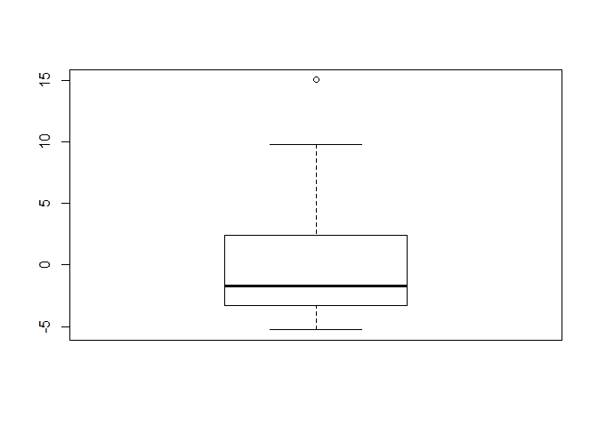

Honda Accord Prices
================
Brian Yi

Introduction
============

**Purpose:** When looking to purchase a used car, I always find it difficult to gauge prices since used cars vary in mileage and age. Furthermore, I don't know if there is a significant difference in pricing between German, Japanese, or American cars of varying types (sedan or SUV). It is especially difficult to tell which car model is most worth its price. Even though these questions have more definitive answers when purchasing a new car, it can be quite different for used cars since certain cars may depreciate faster than others. In this project, we are building a model that can assist in evaluating the price of used cars based on all these features.

**Method of Approach:** We will be using the UsedCarLot dataset that has the following five variables: `age`, `price`, `mileage`, `model`, `make`, and `year`. This project will be split into two parts in predicting our response variable, `price`:

**Part 1:** Since I want to purchase a Honda Accord, we will determine what prices I should be expecting based on an Accord's `age` and `mileage`. We build a few different linear and polynomial regression models with these two variables to predict `price`. We do some hypothesis testing to briefly evaluate these models before using the nested F-test to determine the best model. Next, we conduct some residual analysis for our best model to check for constant variance, normality, and zero mean. Finally, we take our model out for a spin and predict the prices for a Honda Accord that I would be looking to buy.

**Part 2:** For the second part of this project, we want to see if the average prices of cars are different between various car models. We use a one-way ANOVA test, with `model` as the predictor and `price` as the response variable, to detect if any car model has a different mean price from the others.

We also want to determine whether cars with a different country of manufacture and of a different type (sedan or SUV) have a different mean price. Therefore, we add two new predictors, `type` and `country`, in order to conduct this analysis. We use a two-way ANOVA test, with the independent variables being `type` and `country`, to predict `price`.

**Results:** The model we found (multiple linear regression with `age` and `mileage` as predictors) for predicting Honda Accord prices did a good job in fitting our dataset based on the metrics we evaluated it with. Our analysis of whether car prices differed based on model, type (sedan or SUV), and country of manufacture revealed that German cars were the most expensive. We do note that this result is heavily influenced by our limited dataset.

Part 1: Honda Accord Models
===========================

We first import the UsedCarLot dataset and select a subset of 40 observations for the Honda Accord model.

``` r
# Taking only a subset of 40 observations of Honda Accord model
set.seed(14)
UsedCarLot <- read_csv("UsedCarLot.csv")
Accord = sample_n(subset(UsedCarLot, model == "Accord"), 40)
```

Model \#1: Linear Regression
----------------------------

First, we take a peek at the dataset.

``` r
# Look at dataset
head(Accord)
```

    ## # A tibble: 6 x 6
    ##     age price mileage model  make   year
    ##   <dbl> <dbl>   <dbl> <chr>  <chr> <dbl>
    ## 1     7 25.4    48.8  Accord Honda  2012
    ## 2     5 32.0    29.2  Accord Honda  2014
    ## 3    14  9.45  152.   Accord Honda  2005
    ## 4     3 47.0    16.0  Accord Honda  2016
    ## 5     3 47.0     7.91 Accord Honda  2016
    ## 6    13 12.0   165.   Accord Honda  2006

------------------------------------------------------------------------

We create a linear regression model by using `age` to predict the `price` of Honda Accords.

``` r
# Creating a linear model
(mod1 = lm(price ~ age, data = Accord))
```

    ## 
    ## Call:
    ## lm(formula = price ~ age, data = Accord)
    ## 
    ## Coefficients:
    ## (Intercept)          age  
    ##      43.861       -2.365

The least squares regression line is `price = 43.861 - 2.365age`. A brand new car of age zero would be at a price of 43,000 dollars. Each year that the car ages, the price drops by 2,365 dollars since the slope is -2.365. The slope being negative makes sense because the price of car should drop as a car ages.

------------------------------------------------------------------------

We plot Model \#1 with our data to take an initial look at its fit.

``` r
# Plotting observations along with Model #1
plot(price ~ age, data = Accord)
abline(mod1)
```


At first glance, the linear model seems to fit the dataset well.

------------------------------------------------------------------------

We conduct a t-test for correlation to identify any correlation between the `age` and `price` of a Honda Accord.

``` r
# t-test for correlation
cor.test(Accord$price, Accord$age)
```

    ## 
    ##  Pearson's product-moment correlation
    ## 
    ## data:  x and y
    ## t = -13.74, df = 38, p-value = 2.547e-16
    ## alternative hypothesis: true correlation is not equal to 0
    ## 95 percent confidence interval:
    ##  -0.9530264 -0.8394602
    ## sample estimates:
    ##        cor 
    ## -0.9123819

The null hypothesis is that the population correlation between `price` and `age` is zero. The alternative hypothesis is that the population correlation between `price` and `age` is not zero. The t-statistic is -13.74 meaning the correlation between `price` and `age` is not zero. Since the p-value of 2.547e-16 is less than 0.05, the null hypothesis is false not due to chance. Therefore, the alternative hypothesis is true indicating that there is a correlation between the `price` and `age` of Honda Accords.

------------------------------------------------------------------------

We conduct an ANOVA test for regression as another metric for evaluating correlation between `price` and `age`.

``` r
# ANOVA test for regression
anova(mod1)
```

    ## Analysis of Variance Table
    ## 
    ## Response: price
    ##           Df Sum Sq Mean Sq F value    Pr(>F)    
    ## age        1 5167.4  5167.4  188.79 2.547e-16 ***
    ## Residuals 38 1040.1    27.4                      
    ## ---
    ## Signif. codes:  0 '***' 0.001 '**' 0.01 '*' 0.05 '.' 0.1 ' ' 1

The null hypothesis is that the slope is zero. The alternative hypothesis is that the slope is not zero. The F-statistic is way larger than 1, indicating that the alternative hypothesis is correct. The p-value of 2.547e-16 is less than 0.05 so the null hypothesis is false not due to chance. Therefore the alternative hypothesis is true and we can again confirm that `price` and `age` have some sort of relationship for Honda Accords.

Model \#2: Multiple linear regression
-------------------------------------

Next, we create a multiple linear regression model where we use `age` and `mileage` as variables to predict `price`.

``` r
# Multiple linear regression model
(mod2 = lm(price ~ age + mileage, data = Accord))
```

    ## 
    ## Call:
    ## lm(formula = price ~ age + mileage, data = Accord)
    ## 
    ## Coefficients:
    ## (Intercept)          age      mileage  
    ##    42.08752     -1.10407     -0.09795

------------------------------------------------------------------------

We conduct individual t-tests for slope to find correlation between each of the predictors `age` and `mileage`, and the target variable: `price`.

``` r
# t-test for slope
summary(mod2)
```

    ## 
    ## Call:
    ## lm(formula = price ~ age + mileage, data = Accord)
    ## 
    ## Residuals:
    ##    Min     1Q Median     3Q    Max 
    ## -5.277 -3.221 -1.724  2.346 15.039 
    ## 
    ## Coefficients:
    ##             Estimate Std. Error t value Pr(>|t|)    
    ## (Intercept) 42.08752    1.35642  31.028  < 2e-16 ***
    ## age         -1.10407    0.39441  -2.799  0.00809 ** 
    ## mileage     -0.09795    0.02827  -3.464  0.00136 ** 
    ## ---
    ## Signif. codes:  0 '***' 0.001 '**' 0.01 '*' 0.05 '.' 0.1 ' ' 1
    ## 
    ## Residual standard error: 4.607 on 37 degrees of freedom
    ## Multiple R-squared:  0.8735, Adjusted R-squared:  0.8666 
    ## F-statistic: 127.7 on 2 and 37 DF,  p-value: < 2.2e-16

The null hypothesis for both predictors is that the slope is zero. The alternative hypothesis is that the slope is not zero.

-   `age` has a t-statistic of -2.799 indicating that the sample slope is about three standard deviations below a slope of zero. Along with a p-value less than 0.05, we can reject the null hypothesis and say that `age` is a reasonable predictor for `price`.
-   `mileage` has a t-value of -3.464, which indicates that the slope is more than three standard deviations below a slope of zero. The p-value is significant once again indicating that the null hypothesis is false. Thus, `mileage` is also a reasonable predictor for `price`.

Individually, both predictors have a significant correlation with `price`.

------------------------------------------------------------------------

More importantly, we want to know whether collectively the predictors have a correlation with `price`. Thus, we conduct a F-test of overall significance to detect any such correlation.

``` r
# F-test
summary(mod2)
```

    ## 
    ## Call:
    ## lm(formula = price ~ age + mileage, data = Accord)
    ## 
    ## Residuals:
    ##    Min     1Q Median     3Q    Max 
    ## -5.277 -3.221 -1.724  2.346 15.039 
    ## 
    ## Coefficients:
    ##             Estimate Std. Error t value Pr(>|t|)    
    ## (Intercept) 42.08752    1.35642  31.028  < 2e-16 ***
    ## age         -1.10407    0.39441  -2.799  0.00809 ** 
    ## mileage     -0.09795    0.02827  -3.464  0.00136 ** 
    ## ---
    ## Signif. codes:  0 '***' 0.001 '**' 0.01 '*' 0.05 '.' 0.1 ' ' 1
    ## 
    ## Residual standard error: 4.607 on 37 degrees of freedom
    ## Multiple R-squared:  0.8735, Adjusted R-squared:  0.8666 
    ## F-statistic: 127.7 on 2 and 37 DF,  p-value: < 2.2e-16

The null hypothesis is that the coefficients for all the predictors is zero. The alternative hypothesis is that at least one of the coefficients is not zero. The F-statistic is 127.7, which is greater than 1, so we reject the null hypothesis and say that the alternative hypothesis is true. The p-value is 2.2e-16, which is less than 0.05, indicating that this is not due to chance. Thus, the alternative hypothesis is true, and at least one of our predictors has a correlation with the price of a Honda Accord.

------------------------------------------------------------------------

We suspect that `age` and `mileage` might be related since the longer you have a car, the more mileage it should have on it. This relationship is known as multicollinearity, a characteristic we do not want to exist between any of our predictors. We check for multicollinearity by calculating the variance inflation factor for our model.

``` r
# Checking VIF to determine multicollinearity
VIF = 1 / (1 - summary(mod2)$r.squared)
VIF
```

    ## [1] 7.903922

If there is no multicollinearity, the VIF value is close to 1. In this case, the VIF value is much greater than five, so there is a strong correlation between the two predictors, `age` and `mileage`. If there is such a strong correlation, we may consider transforming the variables or removing one of them from our model.

Model \#3: Polynomial models
----------------------------

**Quadratic Model**

We test a few polynomial models to see if any fit our data better than our linear regression models.

``` r
# Quadratic model
(mod3 = lm(price ~ age + I(age^2), data = Accord))
```

    ## 
    ## Call:
    ## lm(formula = price ~ age + I(age^2), data = Accord)
    ## 
    ## Coefficients:
    ## (Intercept)          age     I(age^2)  
    ##    46.45684     -3.21233      0.04545

------------------------------------------------------------------------

We conduct an F-test for regression to compare our quadratic model with an intercept-only model (no predictors).

``` r
# F-test
summary(mod3)
```

    ## 
    ## Call:
    ## lm(formula = price ~ age + I(age^2), data = Accord)
    ## 
    ## Residuals:
    ##     Min      1Q  Median      3Q     Max 
    ## -7.3409 -3.4458 -0.9437  3.4679 14.6532 
    ## 
    ## Coefficients:
    ##             Estimate Std. Error t value Pr(>|t|)    
    ## (Intercept) 46.45684    2.79899  16.598  < 2e-16 ***
    ## age         -3.21233    0.80474  -3.992 0.000299 ***
    ## I(age^2)     0.04545    0.04220   1.077 0.288371    
    ## ---
    ## Signif. codes:  0 '***' 0.001 '**' 0.01 '*' 0.05 '.' 0.1 ' ' 1
    ## 
    ## Residual standard error: 5.221 on 37 degrees of freedom
    ## Multiple R-squared:  0.8375, Adjusted R-squared:  0.8288 
    ## F-statistic: 95.37 on 2 and 37 DF,  p-value: 2.506e-15

The null hypothesis is that the coefficients of all the predictors is zero. The alternative hypothesis is that at least one of the coefficients of the predictors is not zero. The F-statistic is 95.37, which is greater than 1, so we reject the null hypothesis and say that the alternative hypothesis is true. The p-value is 2.506e-15, which is less than 0.05, indicating that this is not due to chance. Therefore, the F-test explains a significant amount of variability within our model and indicates at least one of the predictors is effective in this model.

------------------------------------------------------------------------

Let us evaluate the cons of the model.

``` r
b0.mod3 = summary(mod3)$coefficient[1, 1]
b1.mod3 = summary(mod3)$coefficient[2, 1] 
b2.mod3 = summary(mod3)$coefficient[3, 1]
plot(price ~ age, data = Accord, main = "Quadratic Model", ylim = c(-5, 50), xlim = c(0, 70))
curve(b0.mod3 + b1.mod3 * x + b2.mod3 * x^2, add = TRUE)
abline(0,0)
```


According to the graph above, when a Honda Accord is approximately 20 years of age, the car's predicted price becomes zero and then becomes negative. Between the ages of 20 and 50, the predicted price remains negative. At approximately 50 years in age, a Honda Accord's predicted value goes from negative to zero again, and from then on increases (positively). By the time the car is 70 years old, it is worth the same amount as if it were brand new. This does not make sense since cars do not suddenly grow in value after getting older. Only certain unique antique cards gain value after being old for a long time, but I do not see this being the case for Honda Accords. Thus, our model is flawed starting from the age of approximately 20 and older.

------------------------------------------------------------------------

Now let us review higher order polynomial models and compare them to our quadratic model.

**Cubic Model**

We conduct a nested F-test to determine whether the addition of the cubic term improves our quadratic model.

``` r
# Cubic model
(mod3Cubic = lm(price ~ age + I(age^2) + I(age^3), data = Accord))
```

    ## 
    ## Call:
    ## lm(formula = price ~ age + I(age^2) + I(age^3), data = Accord)
    ## 
    ## Coefficients:
    ## (Intercept)          age     I(age^2)     I(age^3)  
    ##    37.51366      0.77341     -0.39667      0.01387

``` r
anova(mod3, mod3Cubic)
```

    ## Analysis of Variance Table
    ## 
    ## Model 1: price ~ age + I(age^2)
    ## Model 2: price ~ age + I(age^2) + I(age^3)
    ##   Res.Df     RSS Df Sum of Sq      F  Pr(>F)  
    ## 1     37 1008.49                              
    ## 2     36  913.81  1     94.68 3.7299 0.06135 .
    ## ---
    ## Signif. codes:  0 '***' 0.001 '**' 0.01 '*' 0.05 '.' 0.1 ' ' 1

For a nested F-Test, the null hypothesis is that the coefficients of all the additonal predictors is zero. The alternative hypothesis is that at least one of the coefficients of the additional predictors is not zero. The F-statistic is 3.7299, which is not equal to one, indicating we should reject the null hypothesis. Unfortunately, a p-value of 0.06135 isn't significant so we fail to reject the null hypothesis. In other words, the addition of the cubic term is not a significant improvement in predicting the price of a Honda Accord.

------------------------------------------------------------------------

**Quartic Model**

We again conduct a nested F-test to determine whether the addition of a cubic and quartic term improves our quadratic model.

``` r
# Quartic model
(mod3Quartic = lm(price ~ age + I(age^2) + I(age^3) + I(age^4), data = Accord))
```

    ## 
    ## Call:
    ## lm(formula = price ~ age + I(age^2) + I(age^3) + I(age^4), data = Accord)
    ## 
    ## Coefficients:
    ## (Intercept)          age     I(age^2)     I(age^3)     I(age^4)  
    ##  33.8026258    3.0915309   -0.8460700    0.0463106   -0.0007685

``` r
anova(mod3, mod3Quartic)
```

    ## Analysis of Variance Table
    ## 
    ## Model 1: price ~ age + I(age^2)
    ## Model 2: price ~ age + I(age^2) + I(age^3) + I(age^4)
    ##   Res.Df     RSS Df Sum of Sq      F Pr(>F)
    ## 1     37 1008.49                           
    ## 2     35  909.33  2    99.165 1.9084 0.1634

The F-statistic is 1.9084, which is not equal to one, indicating we should reject the null hypothesis. However, a p-value of 0.1634 is once again not significant so the addition of the cubic and quartic terms is not an improvement in predicting the price of a Honda Accord.

------------------------------------------------------------------------

**Quintic Model**

We now check to see if the addition of a cubic, quartic, and quintic term improves our quadratic model.

``` r
# Quintic Model
(mod3Quintic = lm(price ~ age + I(age^2) + I(age^3) + I(age^4) + I(age^5), data = Accord))
```

    ## 
    ## Call:
    ## lm(formula = price ~ age + I(age^2) + I(age^3) + I(age^4) + I(age^5), 
    ##     data = Accord)
    ## 
    ## Coefficients:
    ## (Intercept)          age     I(age^2)     I(age^3)     I(age^4)  
    ##   5.583e+01   -1.427e+01    3.854e+00   -5.039e-01    2.792e-02  
    ##    I(age^5)  
    ##  -5.449e-04

``` r
anova(mod3, mod3Quintic)
```

    ## Analysis of Variance Table
    ## 
    ## Model 1: price ~ age + I(age^2)
    ## Model 2: price ~ age + I(age^2) + I(age^3) + I(age^4) + I(age^5)
    ##   Res.Df     RSS Df Sum of Sq     F Pr(>F)
    ## 1     37 1008.49                          
    ## 2     34  873.46  3    135.03 1.752 0.1749

The F-statistic is 1.752, which is not equal to one, indicating we should reject the null hypothesis. A p-value of 0.1749 is also not significant so the addition of the cubic, quartic, and quintic terms is not a significant improvement in predicting the price of a Honda Accord.

**Our best polynomial model is the quadratic model.**

Model \#4: Complete Second Order Model
--------------------------------------

We will now explore a complete second order model that use `age`, `mileage`, and the interaction term `age*mileage` to predict `price`.

``` r
# Complete second order model
(mod4 = lm(price ~ age + mileage + I(age^2) + I(mileage^2) + I(age*mileage), data = Accord))
```

    ## 
    ## Call:
    ## lm(formula = price ~ age + mileage + I(age^2) + I(mileage^2) + 
    ##     I(age * mileage), data = Accord)
    ## 
    ## Coefficients:
    ##      (Intercept)               age           mileage          I(age^2)  
    ##       44.6911206        -1.1448827        -0.1989774         0.0009998  
    ##     I(mileage^2)  I(age * mileage)  
    ##        0.0003533         0.0016999

------------------------------------------------------------------------

We conduct the F-test of overall significance regression to compare our complete second order model with an intercept-only model.

``` r
# F-test for regression
summary(mod4)
```

    ## 
    ## Call:
    ## lm(formula = price ~ age + mileage + I(age^2) + I(mileage^2) + 
    ##     I(age * mileage), data = Accord)
    ## 
    ## Residuals:
    ##    Min     1Q Median     3Q    Max 
    ## -5.875 -3.002 -0.801  2.432 15.653 
    ## 
    ## Coefficients:
    ##                    Estimate Std. Error t value Pr(>|t|)    
    ## (Intercept)      44.6911206  2.5979805  17.202   <2e-16 ***
    ## age              -1.1448827  0.9613496  -1.191   0.2419    
    ## mileage          -0.1989774  0.0762514  -2.609   0.0134 *  
    ## I(age^2)          0.0009998  0.1459593   0.007   0.9946    
    ## I(mileage^2)      0.0003533  0.0008874   0.398   0.6930    
    ## I(age * mileage)  0.0016999  0.0229299   0.074   0.9413    
    ## ---
    ## Signif. codes:  0 '***' 0.001 '**' 0.01 '*' 0.05 '.' 0.1 ' ' 1
    ## 
    ## Residual standard error: 4.573 on 34 degrees of freedom
    ## Multiple R-squared:  0.8855, Adjusted R-squared:  0.8686 
    ## F-statistic: 52.58 on 5 and 34 DF,  p-value: 4.949e-15

The null hypothesis is that the coefficients of all the predictors is zero. The alternative hypothesis is that at least one of the coefficients of the predictors is not zero. The F-statistic is 52.58, which is greater than 1, so we want to reject the null hypothesis and say that the alternative hypothesis is true. The p-value is 4.49e-15, which is less than 0.05, indicating that this is not due to chance. Therefore, the F-test explains a significant amount of variability within our model and indicates at least one of the predictors is effective in this model.

------------------------------------------------------------------------

Model Comparison
----------------

We first compare Model \#1 (simple linear) to Model \#2 (multiple linear) through a nested F-test.

``` r
# Nested F-test between Model #1 and Model #2
anova(mod1, mod2)
```

    ## Analysis of Variance Table
    ## 
    ## Model 1: price ~ age
    ## Model 2: price ~ age + mileage
    ##   Res.Df     RSS Df Sum of Sq      F   Pr(>F)   
    ## 1     38 1040.12                                
    ## 2     37  785.37  1    254.75 12.002 0.001361 **
    ## ---
    ## Signif. codes:  0 '***' 0.001 '**' 0.01 '*' 0.05 '.' 0.1 ' ' 1

For a nested F-Test, the null hypothesis is that the coefficients of all the additonal predictors is zero. The alternative hypothesis is that at least one of the coefficients of the additional predictors is not zero. The F-statistic is 12.002, which is not equal to one, indicating we should reject the null hypothesis. A p-value of 0.001361 is significant so we can reject the null hypothsis. In other words, the addition of the mileage term to our simple linear model is a significant improvement in predicting the price of a Honda Accord.

**Model \#2 is better than Model \#1.**

------------------------------------------------------------------------

We compare our best polynomial Model \#3 (quadratic) to Model \#4 (complete second order).

``` r
anova(mod3, mod4)
```

    ## Analysis of Variance Table
    ## 
    ## Model 1: price ~ age + I(age^2)
    ## Model 2: price ~ age + mileage + I(age^2) + I(mileage^2) + I(age * mileage)
    ##   Res.Df     RSS Df Sum of Sq      F   Pr(>F)   
    ## 1     37 1008.49                                
    ## 2     34  710.88  3    297.62 4.7448 0.007187 **
    ## ---
    ## Signif. codes:  0 '***' 0.001 '**' 0.01 '*' 0.05 '.' 0.1 ' ' 1

The F-statistic is 4.7448, which is not equal to one, indicating we should reject the null hypothesis. A p-value of 0.007187 is significant so the addition of the terms that involve mileage is a significant improvement to our quadratic model in predicting the price of a Honda Accord.

**Model \#4 is better than Model \#3.**

------------------------------------------------------------------------

We finally compare Model \#2 (multiple linear) to Model \#4 (complete second order).

``` r
anova(mod2, mod4)
```

    ## Analysis of Variance Table
    ## 
    ## Model 1: price ~ age + mileage
    ## Model 2: price ~ age + mileage + I(age^2) + I(mileage^2) + I(age * mileage)
    ##   Res.Df    RSS Df Sum of Sq      F Pr(>F)
    ## 1     37 785.37                           
    ## 2     34 710.88  3    74.489 1.1876  0.329

The F-statistic is 1.1876, which is very close to one, indicating that the null hypothesis is true. In other words, the addition of the quadratic and interaction terms is not an improvement over our multiple linear regression model in predicting the price of a Honda Accord. Sometimes, simpler is just better.

**Model \#2 is better than Model \#4. Thus, Model \#2 is the best out of our four models.**

------------------------------------------------------------------------

Final Model Evaluation
----------------------

### Residual Analysis

Now that we have our final model (`price ~ age + mileage`), we first analyze the residuals to check the assumptions made for a multiple linear regression model. We first look at a residuals vs fits plot to check for linearity and constant variance of residuals.

``` r
# Residuals vs fits plot
plot(mod2$residuals ~ mod2$fitted.values)
abline(a = 0, b = 0)
```


``` r
# Standardized residuals vs fits plot
plot(rstandard(mod2) ~ mod2$fitted.values)
abline(a = 0, b = 0)
```


``` r
# Boxplot of residuals
boxplot(mod2$residuals)
```



The residuals versus fits plot is useful in assessing the linearity of a model. Ideally, we would want to see a random pattern with points scattered at a constant distance from the line. However, the plot shows a slight curve moving from the left to right throughout the data set. Furthermore, a lot of the data seems to be clumped at the right side of the graph. This signifies that linearity does not hold too well in our model and variance is not constant.

We then looked at a standarized residual vs fits plot to check for potential outliers. There is a point close to a value of three, indicating that it can be an outlier since it is close to three standard deviations from 0. The boxplot confirms that there is one outlier point; you can see it is roughly more than 1.5 IQR's beyond Q3.

------------------------------------------------------------------------

We look at a normal quantile plot and histogram of residuals to check for normality of residuals in our model.

``` r
# Residual histogram
hist(mod2$residuals)
```


``` r
# Normal quantile plot
qqnorm(mod2$residuals)
qqline(mod2$residuals)
```


The histogram of the residuals shows that there is a distinct right skew. This pattern is also seen in the normal quantile plot; there are many points to the right of 0 that do not mirror the line, indicating that the residuals aren't normally distributed.

------------------------------------------------------------------------

We then look at the standarized and studentized maximum residual to evaluate the potential outlier we saw from our boxplot earlier.

``` r
# Max residual, standarized, and studentized
max(abs(residuals(mod2)))
```

    ## [1] 15.03922

``` r
max(abs(rstandard(mod2)))
```

    ## [1] 3.321223

``` r
max(abs(rstudent(mod2)))
```

    ## [1] 3.910369

The car with the largest residual has a residual with magnitude 15. The standarized residual for this car is 3.32, which is close to 3, and draws our concern that it could be a potential outlier. The studentized residual for this same point is 3.91, which somewhat differs from the standarized residual. This means that when we take out this point, the fit of the model does change a noticeable amount. Thus, our point can be considered as an outlier; we decide to leave our point in the model since it is less than 3% of our total data.

### Final Prediction

After some residual analysis, we finally get to use our model to predict the value of Honda Accord. I am looking for about a 5-year old Accord with no more than 40,000 miles.

``` r
# Calculate the predicted value of a 5-year old Honda Accordwith 40,000 miles
newx = data.frame(age = 5, mileage = 40)
predict.lm(mod2, newx, interval = "confidence", level = .90)
```

    ##      fit      lwr      upr
    ## 1 32.649 31.30714 33.99086

``` r
predict.lm(mod2, newx, interval = "prediction", level = .90)
```

    ##      fit      lwr      upr
    ## 1 32.649 24.76128 40.53672

The predicted value of the `price` for a 5 year old Honda Accord with 40,000 miles is approximately $32,649. The 90% confidence interval for the mean `price` of a Honda Accord with these traits is (31.30714, 33.99086). The 90% prediction interval for the mean `price` of an individual Honda Accord with these traits is (24.76128, 40.53672). Knowing these intervals, now I know what price range I should be looking for when purchasing my Honda Accord!

Part 2: General Car Price Analysis
==================================

We first take subsets from UsedCarLot and added two new variables called `country` and `type`.

``` r
set.seed(14)
BMW328 = sample_n(subset(UsedCarLot, model == "328"), 35) #sedan(German)
BMW328$country = "Germany"
BMW328$type = "Sedan"
BMWX3 = sample_n(subset(UsedCarLot, model == "X3"), 35)   #SUV(German)
BMWX3$country = "Germany"
BMWX3$type = "SUV"
ToyotaRav4 = sample_n(subset(UsedCarLot, model == "Rav4"), 35)     #SUV(Jap)
ToyotaRav4$country = "Japan"
ToyotaRav4$type = "SUV"
HondaAccord = sample_n(subset(UsedCarLot, model == "Accord"), 35)  #sedan(Jap)
HondaAccord$country = "Japan"
HondaAccord$type = "Sedan"
JeepCherokee = sample_n(subset(UsedCarLot, model == "Cherokee"), 35)  #SUV(US)
JeepCherokee$country = "US"
JeepCherokee$type = "SUV"
BuickLaCrosse = sample_n(subset(UsedCarLot, model == "LaCrosse"), 35) #sedan(US)
BuickLaCrosse$country = "US"
BuickLaCrosse$type = "Sedan"

UsedCar = rbind(BMW328, BMWX3, HondaAccord, ToyotaRav4, BuickLaCrosse, JeepCherokee)
head(UsedCar)
```

    ## # A tibble: 6 x 8
    ##     age price mileage model make   year country type 
    ##   <dbl> <dbl>   <dbl> <chr> <chr> <dbl> <chr>   <chr>
    ## 1     4  26.0   30.9  328   BMW    2015 Germany Sedan
    ## 2     6  24.0   41.3  328   BMW    2013 Germany Sedan
    ## 3     4  27.9   13.8  328   BMW    2015 Germany Sedan
    ## 4     3  29.5    8.83 328   BMW    2016 Germany Sedan
    ## 5     5  29.0   23.4  328   BMW    2014 Germany Sedan
    ## 6     4  28.0   17.8  328   BMW    2015 Germany Sedan

Car Models and Price
--------------------

We want to determine if different used car models have different prices. In order to find out whether certain car models have a higher price, we conduct one-way ANOVA between `model` and `price`. One-way ANOVA assumes constant variance throughout the sample so we must first investigate the variance of means using a boxplot.

``` r
# Boxplot between model and price
boxplot(price ~ model, data = UsedCar)
```


We can see that the mean price for the BMW X3 is a lot higher than the rest of the mean prices of the car models, which all are hovering around a similar mean price. Our guess for now is that different car models do have differing mean prices due to the X3. It's also pretty clear from the boxplot that variance is not constant throughout the differing models. Our one-way ANOVA may be slightly inaccurate as a result of this.

------------------------------------------------------------------------

To take a closer look at variance, we check the standard deviations for each individual model and compare it to the average standard deviation throughout the entire sample.

``` r
# Standard deviation for individual models
tapply(UsedCar$price, UsedCar$model, sd)
```

    ##       328    Accord  Cherokee  LaCrosse      Rav4        X3 
    ##  6.572557 12.286917 10.455506  7.491530  4.118076 18.979896

``` r
# Average standard deviation for all the models
sd(UsedCar$price)
```

    ## [1] 12.50786

This data backs up our boxplot analysis earlier since X3 has a much larger standard deviation compared to the other models. While the average standard deviation is only 12.50786, the X3 model has a much higher standard deviation of 18.979896.

------------------------------------------------------------------------

We initially answer our question heuristically, by comparing the mean price of the entire sample to the individual mean prices of the different models.

``` r
# Average mean price of entire sample
mean(UsedCar$price)
```

    ## [1] 23.6179

``` r
# Mean prices of each model
tapply(UsedCar$price, UsedCar$model, mean)
```

    ##      328   Accord Cherokee LaCrosse     Rav4       X3 
    ## 21.70046 27.18543 22.66403 17.34826 17.85166 34.95754

The average mean price for the entire data set is 23.618 thousand dollars. The mean price for the BMW 328, Jeep Cherokee, and the Honda Accord are relatively close to the overall mean. The Buick LaCrosse and Toyota Rav4 have mean prices of 17.34826 and 17.85166 thousand respectively, which is approximately six thousand below the overall mean. However, the BMW X3 has a mean price of 34.95754, which is approximately 1.5 times greater than the overall sample mean. Thus, there seems to be significant difference in means between the BMW X3 and the rest of the car price means.

------------------------------------------------------------------------

Let us finally conduct the one-way ANOVA for `model` and `price` to see if our earlier analysis is correct.

``` r
# One-way ANOVA test
mod5 = aov(price ~ model, data = UsedCar)
summary(mod5)
```

    ##              Df Sum Sq Mean Sq F value   Pr(>F)    
    ## model         5   7646  1529.2   12.45 1.48e-10 ***
    ## Residuals   204  25051   122.8                     
    ## ---
    ## Signif. codes:  0 '***' 0.001 '**' 0.01 '*' 0.05 '.' 0.1 ' ' 1

The null hypothesis for one-way ANOVA is that all the means for each car model price are equal to one another. The alternative hypothesis is that at least one mean of a car model is not equal to any of the means of the other car models. The non-zero F-value of 12.45 and significant p-value of 1.48e-10 allows us to reject the null hypothesis. Thus, the alternative hypothesis is true, and there is a significant difference among the mean prices of the car models, proving our earlier analysis correct.

------------------------------------------------------------------------

Before we find out if the BMW X3 is the car with the different mean price, we must first check the assumptions for our one-way ANOVA test. For the test to be accurate, the sample must have constant variance throughout each group and the sample must be normally distributed. We check these traits through residual analysis of the model that our `aov` function fit earlier.

``` r
# Residuals vs fits plot
plot(mod5$residuals ~ mod5$fitted.values)
abline(0,0)
```


``` r
# Residual histogram
hist(mod5$residuals)
```


``` r
# Normal quantile plot
qqnorm(mod5$residuals)
qqline(mod5$residuals)
```


The residuals vs fits plot shows that the standard deviation for four of the six car models is between 15 - 20. Meanwhile, there are two groups that have a standard deviation of approximately 7 and 40. Overall, the variance is more inconsistent at larger fitted values. This lack of constant variance is mirrored by our boxplot from earlier.

The histogram of the residuals shows that there is a slight left skew in our model. This defect in normality is again seen in the normal quantile plot where the negative residual points start to stray from the line.

Overall, variance and normality is slightly lacking in our model.

------------------------------------------------------------------------

Our one-way ANOVA test tells us that there is a significant difference in mean prices between different car models. We run Tukey's HSD tests to see exactly which car model prices are significantly different.

``` r
# TukeyHSD
TukeyHSD(mod5)
```

    ##   Tukey multiple comparisons of means
    ##     95% family-wise confidence level
    ## 
    ## Fit: aov(formula = price ~ model, data = UsedCar)
    ## 
    ## $model
    ##                         diff         lwr       upr     p adj
    ## Accord-328         5.4849714  -2.1361961 13.106139 0.3069165
    ## Cherokee-328       0.9635714  -6.6575961  8.584739 0.9991574
    ## LaCrosse-328      -4.3522000 -11.9733675  3.268968 0.5711059
    ## Rav4-328          -3.8488000 -11.4699675  3.772368 0.6944846
    ## X3-328            13.2570857   5.6359182 20.878253 0.0000177
    ## Cherokee-Accord   -4.5214000 -12.1425675  3.099768 0.5288618
    ## LaCrosse-Accord   -9.8371714 -17.4583390 -2.216004 0.0035485
    ## Rav4-Accord       -9.3337714 -16.9549390 -1.712604 0.0068758
    ## X3-Accord          7.7721143   0.1509468 15.393282 0.0427242
    ## LaCrosse-Cherokee -5.3157714 -12.9369390  2.305396 0.3421035
    ## Rav4-Cherokee     -4.8123714 -12.4335390  2.808796 0.4573468
    ## X3-Cherokee       12.2935143   4.6723468 19.914682 0.0000900
    ## Rav4-LaCrosse      0.5034000  -7.1177675  8.124568 0.9999654
    ## X3-LaCrosse       17.6092857   9.9881182 25.230453 0.0000000
    ## X3-Rav4           17.1058857   9.4847182 24.727053 0.0000000

The p adj column tells us which of the comparisons between the mean prices of two different models are significant. For example, the mean price for a X3 is 13 thousand dollars more than the mean price of a 328. We are 95% confident that that difference is between 5.6359182 and 20.878253 thousand dollars.

-   **BMW X3:** We see that all the BMW X3 comparisons have a significant p adj value that is less than 0.05, indicating that the mean price for BMW X3 is different than the mean price of all the other models.

-   **Honda Accord:** The only other two comparisons that have a significant p adj value are between LaCrosse-Accord and Rav4-Accord. I am surprised to see that the Honda Accord actually has a higher mean price of about 9 thousand dollars in both comparisons.

After this final analysis on car model mean prices, we see that the BMW X3 clearly has a different mean price comparatively to other car models. This does not surprise us since the BMW X3 is known as a luxury SUV model that should cost more.

Car Manufacturer and Type
-------------------------

After finding out which car models have a different mean price, we also would like to see if type of car and country of car manufacturer impacts the mean price of a vehicle. We will be using a two-way ANOVA with `type` and `country` as the predictors to find out if there is a difference in mean price between any of the groups. This time we skip the preliminary variance and mean analysis and dive straight into the test.

``` r
# Two-way ANOVA test
mod6 = aov(price ~ type + country, data = UsedCar)
summary(mod6)
```

    ##              Df Sum Sq Mean Sq F value   Pr(>F)    
    ## type          1    498   497.9   3.460 0.064305 .  
    ## country       2   2551  1275.7   8.864 0.000203 ***
    ## Residuals   206  29648   143.9                     
    ## ---
    ## Signif. codes:  0 '***' 0.001 '**' 0.01 '*' 0.05 '.' 0.1 ' ' 1

For a two-way ANOVA test, the null hypothesis is that all means are equal to each other. The alternative hypothesis is that at least one of the means is not equal to the other means.

-   `type`: A non-zero F value and an insignificant p value of 0.064305 indicates that we fail to reject the null hypothesis. Thus, the null hypothesis is true indicating that SUVs and sedans have the same mean price. This might seem unrealistic at first, but keep in mind that the p-value is right outside the 5% criterion we placed on the test. If we set the criterion at 10%, there would be a difference in SUVs and sedan prices.
-   `country`: A non-zero F value and a significant p value of 0.000203 indicates that we can reject the null hypothesis. Thus, the alternative hypothesis is true, and there is a significant difference in the mean price of cars due to country of manufacture.

------------------------------------------------------------------------

Now let us check the assumptions of constant variance and normality for a two-way ANOVA test through some residual analysis.

``` r
# Residuals vs fits plot
plot(mod6$residuals ~ mod6$fitted.values)
abline(0,0)
```


``` r
# Residual histogram
hist(mod6$residuals)
```


``` r
# Normal quantile plot
qqnorm(mod6$residuals)
qqline(mod6$residuals)
```


The variance seems to be pretty inconsistent throughout the residuals vs fits plot. Moving from left to right, the variance starts large, shrinks, then blooms out again.

The histogram of the residuals reveals a slight right skew. The normality is explored further in the normal quantile plot that shows many of the residuals on the right side of the plot not sticking to the line. We also see some of the more extreme negative residuals straying from the line on the left side.

------------------------------------------------------------------------

Now we run a TukeyHSD to see exactly which car groups have a significant difference in price based on `type` or `country`.

``` r
# TukeyHSD
TukeyHSD(mod6)
```

    ##   Tukey multiple comparisons of means
    ##     95% family-wise confidence level
    ## 
    ## Fit: aov(formula = price ~ type + country, data = UsedCar)
    ## 
    ## $type
    ##               diff        lwr     upr    p adj
    ## SUV-Sedan 3.079695 -0.1846194 6.34401 0.064305
    ## 
    ## $country
    ##                    diff       lwr       upr     p adj
    ## Japan-Germany -5.810457 -10.59771 -1.023208 0.0127195
    ## US-Germany    -8.322857 -13.11011 -3.535608 0.0001722
    ## US-Japan      -2.512400  -7.29965  2.274850 0.4316357

-   `type`: As seen from our two-way ANOVA test earlier, SUVs and sedans don't have a significant difference in price.

-   `country`: For country of manufacturer, we see that German cars have a significant difference in prices compared to US and Japanese cars where German cars are on average 8,000 and 6,000 dollars more expensive. Keep in mind that we only have a limited selection of car models that this data is taken from, and the BMW X3 luxury model we saw earlier could be a hidden variable that is causing this difference here.

------------------------------------------------------------------------

Since I find the fact that Sedans and SUVs have an insignificant difference in price unrealistic, I add an interaction term `type*country` to our model to see if this makes that difference significant.

``` r
# two-way ANOVA test
mod7 = aov(price ~ type + country + type*country, data = UsedCar)
summary(mod7)
```

    ##               Df Sum Sq Mean Sq F value   Pr(>F)    
    ## type           1    498   497.9   4.055   0.0454 *  
    ## country        2   2551  1275.7  10.388 5.05e-05 ***
    ## type:country   2   4597  2298.4  18.716 3.44e-08 ***
    ## Residuals    204  25051   122.8                     
    ## ---
    ## Signif. codes:  0 '***' 0.001 '**' 0.01 '*' 0.05 '.' 0.1 ' ' 1

This time we see that all the predictors have a non-zero F value and a significant p value, including car type. This means that we can reject the null hypothesis and say that there is significant difference in the mean price between SUVs and sedans.

------------------------------------------------------------------------

We conduct a TukeyHSD to once again check our individual comparisons for mean price.

``` r
# TukeyHSD
TukeyHSD(mod7)
```

    ##   Tukey multiple comparisons of means
    ##     95% family-wise confidence level
    ## 
    ## Fit: aov(formula = price ~ type + country + type * country, data = UsedCar)
    ## 
    ## $type
    ##               diff        lwr      upr     p adj
    ## SUV-Sedan 3.079695 0.06424284 6.095148 0.0453583
    ## 
    ## $country
    ##                    diff        lwr       upr     p adj
    ## Japan-Germany -5.810457 -10.232800 -1.388115 0.0061883
    ## US-Germany    -8.322857 -12.745200 -3.900515 0.0000431
    ## US-Japan      -2.512400  -6.934742  1.909942 0.3740251
    ## 
    ## $`type:country`
    ##                                  diff        lwr        upr     p adj
    ## SUV:Germany-Sedan:Germany  13.2570857   5.635918 20.8782532 0.0000177
    ## Sedan:Japan-Sedan:Germany   5.4849714  -2.136196 13.1061390 0.3069165
    ## SUV:Japan-Sedan:Germany    -3.8488000 -11.469968  3.7723675 0.6944846
    ## Sedan:US-Sedan:Germany     -4.3522000 -11.973368  3.2689675 0.5711059
    ## SUV:US-Sedan:Germany        0.9635714  -6.657596  8.5847390 0.9991574
    ## Sedan:Japan-SUV:Germany    -7.7721143 -15.393282 -0.1509468 0.0427242
    ## SUV:Japan-SUV:Germany     -17.1058857 -24.727053 -9.4847182 0.0000000
    ## Sedan:US-SUV:Germany      -17.6092857 -25.230453 -9.9881182 0.0000000
    ## SUV:US-SUV:Germany        -12.2935143 -19.914682 -4.6723468 0.0000900
    ## SUV:Japan-Sedan:Japan      -9.3337714 -16.954939 -1.7126039 0.0068758
    ## Sedan:US-Sedan:Japan       -9.8371714 -17.458339 -2.2160039 0.0035485
    ## SUV:US-Sedan:Japan         -4.5214000 -12.142568  3.0997675 0.5288618
    ## Sedan:US-SUV:Japan         -0.5034000  -8.124568  7.1177675 0.9999654
    ## SUV:US-SUV:Japan            4.8123714  -2.808796 12.4335390 0.4573468
    ## SUV:US-Sedan:US             5.3157714  -2.305396 12.9369390 0.3421035

-   `type`: The Tukey HSD indicates that there is a significant difference in price of approximately 3,000 dollars between SUV and Sedan prices.
-   `country`: We again see that German cars are more expensive comparatively to US and Japanese cars.
-   `type*country`: As for the new interaction predictor, we are not surprised to again see German manufactured cars to have a signficant difference in mean price compared with any other car. However, this time we get to see that it is particularly German SUVs that have a difference in price compared to other cars. The only German SUV we have in our dataset is the BMW X3, which we already saw from our one-way ANOVA to have a difference in price compared to any other model. This confirms our suspicions from our last model that the BMW X3 is responsible for why German cars were more expensive than other cars in our models.

------------------------------------------------------------------------

We visualize the comparisons between `type` and `country` through an interaction plot.

``` r
# Interaction plot
interaction.plot(UsedCar$type, UsedCar$country, UsedCar$price)
```


``` r
interaction.plot(UsedCar$country, UsedCar$type, UsedCar$price)
```


The first interaction plot shows that the price for SUVs is greater than that of sedans for US and German cars. Specifically, German SUVs are a lot more expensive compared to its sedan counterparts. However, Japanese SUVs are actually cheaper than Japanese sedans.

The second interaction plot shows that in terms of SUVs, German SUVs are the most expensive, followed by US SUVs, and lastly Japanese SUVs. In terms of sedans, Japanese sedans are the most expensive, followed by German sedans, and lastly US sedans.

At this point, it is pretty apparent that our limited selection of six car models greatly influences our analysis; we will discuss this further in our conclusion.

Conclusion
==========

**Part 1:**

After testing out various regression models, the nested F-test helped us determine that Model \#2, the multiple linear regression model, was the best model in predicting Honda Accord prices using `mileage` and `age`. Sometimes simpler is better! We should keep in mind that our dataset was fairly small for our analysis and that having a bigger set would allow us to fit a better model in predicting Honda Accord prices.

**Part 2:**

We found out that different car models do have different mean prices, specifically that the BMW X3 has a different price comparatively to the rest. The BMW X3 luxury model heavily influenced our two-way ANOVA test, which suggested that German cars were more expensive than any other car. Since the BMW X3 is one of two German car models in the set, it greatly influenced any further analysis that we did for car `type` and `country`.
