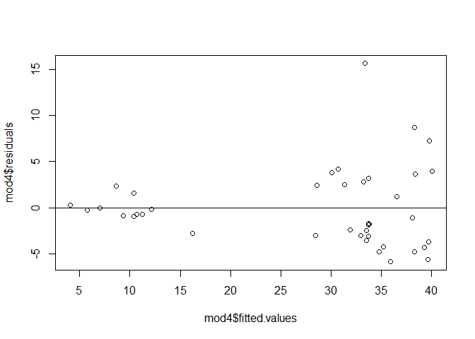

Honda Accord Prices
================
Brian Yi

Introduction
============

This project will be split into two parts:

**Part 1:**

We will be focusing on modeling and statistical analysis using the following models:

    - Single Linear Regression
    - Multiple Linear Regression
    - Polynomial Regression (one variable)
    - Polynomial Regression (two variables)

The dataset we will be using is the UsedCarLot dataset has the following five variables: `age`, `price`, `mileage`, `model`, `make`, and `year`. Our target variable to predict is `price`, and the predictors we will focus on are `age` and `mileage`. We don't consider `model` and `make` since we will only be analyzing the price of Honda Accords. We will use residual analysis visualizations and various hypothesis tests to evaluate individual models. The nested F-test will be our main test used to compare different models and help us to determine the best model for predicting Honda Accord prices.

**Part 2:**

We will be focusing on one-way ANOVA and two-way ANOVA tests for this part to investigate the variance withing roup means within the `UsedCar` dataframe we will create. We will add two new variables, `type` and `country`, in order to conduct these tests. `type` will be either sedan or SUV depending on the car. `country` represents a car's country of manufacture, which will either be Japan, Germany, or the US.

For our one-way ANOVA test, the independent variable we are interested in is the `model` variable with respect to `price`. In other words, we want to determine whether different `model` cars have different `prices`.

For our two-way ANOVA test, the independent variables we are interested are `type` and `country` with respect to `price`. This time, we want to see whether a different `type` of car with different `country` origins will have different `prices`.

Part 1
======

We first import the UsedCarLot dataset and select a subset of 40 observations for the Honda Accord model.

``` r
# Taking only a subset of 40 observations of Honda Accord model
set.seed(14)
UsedCarLot <- read_csv("UsedCarLot.csv")
Accord = sample_n(subset(UsedCarLot, model == "Accord"), 40)
```

Model \#1: Linear Regression
----------------------------

We first take a peek at the dataset.

``` r
# Look at dataset
head(Accord)
```

    ## # A tibble: 6 x 6
    ##     age price mileage model  make   year
    ##   <dbl> <dbl>   <dbl> <chr>  <chr> <dbl>
    ## 1     7 25.4    48.8  Accord Honda  2012
    ## 2     5 32.0    29.2  Accord Honda  2014
    ## 3    14  9.45  152.   Accord Honda  2005
    ## 4     3 47.0    16.0  Accord Honda  2016
    ## 5     3 47.0     7.91 Accord Honda  2016
    ## 6    13 12.0   165.   Accord Honda  2006

------------------------------------------------------------------------

Next we created a linear model by using `age` to predict `price`.

``` r
# Creating a linear model
(mod1 = lm(price~age, data=Accord))
```

    ## 
    ## Call:
    ## lm(formula = price ~ age, data = Accord)
    ## 
    ## Coefficients:
    ## (Intercept)          age  
    ##      43.861       -2.365

The least squares regression line is `price` = 43.861 - 2.365`age`. A brand new car of `age` zero would be at a `price` of 43,000 dollars. Each year that the car ages, the `price` drops by 2,365 dollars since the slope is -2.365. The slope being negative makes sense because the `price` of car should drop as a car ages.

------------------------------------------------------------------------

We plot `mod1` along with the observations.

``` r
# Plotting observations along with mod1
plot(price~age, data=Accord)
abline(mod1)
```


At first glance, the linear model seems to fit the dataset decently.

------------------------------------------------------------------------

We analyze the residuals to determine the accuracy of our model.

``` r
# Residuals vs fits plot
plot(mod1$residuals~mod1$fitted.values)
abline(a=0,b=0)
```


``` r
# Standardized residuals vs fits plot
plot(rstandard(mod1)~mod1$fitted.values)
abline(a=0,b=0)
```


``` r
# Boxplot of residuals
boxplot(mod1$residuals)
```


The residuals versus fits plot is useful in assessing the linearity of a model. The plot shows a slight curve moving from the left to right throughout the data set. Furthermore, a lot of the data seems to be clumped at the right side of the graph. This signifies that linearity does not hold too well in our model.

We then looked at a standarized residual vs fits plot to see if any residuals are extreme. There is a point with a value of 2 which makes it a mild point. There is another point with a value of three, indicating it to be an outlier point since it is very far from the residual line. There are also two points on the left that would be considered influential points due to their distance from the rest of the predictors.

The boxplot confirms that there is one outlier point, as you can see it is roughly more than 1.5 IQR's beyond Q3.

------------------------------------------------------------------------

We further conduct some residual analysis.

``` r
# Residual histogram
hist(mod1$residuals)
```


``` r
# Normal quantile plot
qqnorm(mod1$residuals)
qqline(mod1$residuals)
```


The histogram of the residuals show that the normality of the model is not perfect since there is a right skew.

The normality is explored further in the normal quantile plot that shows many of the points throughout the data not lining perfectly with the line, as well as showing a few data points that are off the line on both the left and right sides of the plot.

------------------------------------------------------------------------

We then look at the standarized and studentized maximum residual to detect potential outliers.

``` r
# Max residual, standarized, and studentized
max(abs(residuals(mod1)))
```

    ## [1] 14.58903

``` r
max(abs(rstandard(mod1)))
```

    ## [1] 2.835998

``` r
max(abs(rstudent(mod1)))
```

    ## [1] 3.151787

The car with the largest residual has a residual with magnitude 14.58903. The standarized residual for this car is 2.835998 and the studentized residual is 3.151787. The max standarized and studentized residuals differ only slightly so this point does not tremendously influence the overall model.

------------------------------------------------------------------------

We found the 90% confidence interval for our prediction model.

``` r
# 90% confidence interval
confint(mod1, level=0.90)
```

    ##                   5 %      95 %
    ## (Intercept) 41.455904 46.265709
    ## age         -2.655714 -2.075207

I am 90% confidence the true mean lies on the interval (-2.075207, -2.655714). This means that we are 90% confident that as as `age` increases per year, the `price` decreases by between (-2.075207, -2.655714) for all Honda Accords.

------------------------------------------------------------------------

We find the Pearson's coefficient to investigate the correlation between `price` and `age`.

``` r
# t-test for correlation
cor.test(Accord$price, Accord$age)
```

    ## 
    ##  Pearson's product-moment correlation
    ## 
    ## data:  x and y
    ## t = -13.74, df = 38, p-value = 2.547e-16
    ## alternative hypothesis: true correlation is not equal to 0
    ## 95 percent confidence interval:
    ##  -0.9530264 -0.8394602
    ## sample estimates:
    ##        cor 
    ## -0.9123819

The null hypothesis is that the population correlation between `price` and `age` is zero. The alternative hypothesis is that the population correlation between `price` and `age` is not zero. The t-statistic is -13.74 meaning the correlation between `price` and `age` is not zero. Since the p-value of 2.547e-16 is less than 0.05, the null hypothesis is false not due to chance. Therefore, the alternative hypothesis is true indicating that there is a population correlation between the `price` and `age` of Honda Accords.

------------------------------------------------------------------------

We conduct an ANOVA test for regression.

``` r
# ANOVA test for regression
anova(mod1)
```

    ## Analysis of Variance Table
    ## 
    ## Response: price
    ##           Df Sum Sq Mean Sq F value    Pr(>F)    
    ## age        1 5167.4  5167.4  188.79 2.547e-16 ***
    ## Residuals 38 1040.1    27.4                      
    ## ---
    ## Signif. codes:  0 '***' 0.001 '**' 0.01 '*' 0.05 '.' 0.1 ' ' 1

The null hypothesis is that the slope is zero. The alternative hypothesis is that the slope is not zero. The F-statistic is way larger than 1, indicating that the alternative hypothesis is correct. The p-value of 2.547e-16 is less than 0.05 so the null hypothesis is false not due to chance. Therefore the alternative hypothesis is true indicating that `price` and `age` have some sort of relationship for Honda Accords.

------------------------------------------------------------------------

Using our model, we predicted the value of a 5 year old Honda Accord.

``` r
# Calculate the predicted value of a 5 year old Honda Accord
newx=data.frame(age=5)
predict.lm(mod1, newx, interval="confidence", level=.90)
```

    ##        fit      lwr      upr
    ## 1 32.03351 30.54923 33.51778

``` r
predict.lm(mod1, newx, interval="prediction", level=.90)
```

    ##        fit      lwr      upr
    ## 1 32.03351 23.08895 40.97807

The predicted value of the `price` for a 5 year old Honda Accord is approximately $32,033.51. The 90% confidence interval for the mean `price` at an `age` of 5 is (30.54923, 33.51778). The 90% prediction interval for the mean `price` of an individual 5 year old car is (23.08895, 40.97807).

------------------------------------------------------------------------

We try some transformations to see if we can find a better model.

``` r
# Various transformations
tf1=lm(formula = log(price) ~ age, data = Accord)
tf2=lm(formula = price ~ log(age), data = Accord)
tf3=lm(formula = log(price) ~ log(age), data = Accord)
tf4=lm(formula = sqrt(price) ~ age, data = Accord)
tf5=lm(formula = 1/(price) ~ age, data = Accord)
tf6=lm(formula = price^2 ~ age, data = Accord)
tf7=lm(formula = exp(price) ~age, data = Accord)

plot(tf1$residuals~tf1$fitted.values)
abline(a=0,b=0)
```


``` r
plot(tf2$residuals~tf2$fitted.values)
abline(a=0,b=0)
```


``` r
plot(tf3$residuals~tf3$fitted.values)
abline(a=0,b=0)
```


``` r
plot(tf4$residuals~tf4$fitted.values)
abline(a=0,b=0)
```


``` r
plot(tf5$residuals~tf5$fitted.values)
abline(a=0,b=0)
```


``` r
plot(tf6$residuals~tf6$fitted.values)
abline(a=0,b=0)
```


``` r
plot(tf7$residuals~tf6$fitted.values)
abline(a=0,b=0)
```


After trying various transformations, the transformation of taking the `log(price)` seems to display the most randomness for the residuals vs fitted values plot. Although a lot of data points are grouped on the right side again, the overall pattern throughout the plot is a lot more random in comparison to to the original model. This indicates that there is more linearity in the transformed model.

Model \#2: Multiple linear regression
-------------------------------------

We create a multiple linear regression model with `age` and `mileage` as predictors for `price`.

``` r
# Multiple linear regression model
(mod2 = lm(formula=price~age+mileage, data=Accord))
```

    ## 
    ## Call:
    ## lm(formula = price ~ age + mileage, data = Accord)
    ## 
    ## Coefficients:
    ## (Intercept)          age      mileage  
    ##    42.08752     -1.10407     -0.09795

------------------------------------------------------------------------

We first take a look at the largest residual for `mod2`.

``` r
# Standarized and studentized residuals
max(abs(residuals(mod2)))
```

    ## [1] 15.03922

``` r
max(abs(rstandard(mod2)))
```

    ## [1] 3.321223

``` r
max(abs(rstudent(mod2)))
```

    ## [1] 3.910369

The car with the largest residual has a residual with magnitude 15.03922. The standarized residual for this car is 3.321223 and the studentized residual is 3.910369. The max standarized and studentized residuals differ a significant amount so we consider this point an outlier that has influence on the overall model.

------------------------------------------------------------------------

We conduct a t-test to find corretation between the predictors `age` and `mileage`, and the target variable: `price`.

``` r
# t-test for correlation
summary(mod2)
```

    ## 
    ## Call:
    ## lm(formula = price ~ age + mileage, data = Accord)
    ## 
    ## Residuals:
    ##    Min     1Q Median     3Q    Max 
    ## -5.277 -3.221 -1.724  2.346 15.039 
    ## 
    ## Coefficients:
    ##             Estimate Std. Error t value Pr(>|t|)    
    ## (Intercept) 42.08752    1.35642  31.028  < 2e-16 ***
    ## age         -1.10407    0.39441  -2.799  0.00809 ** 
    ## mileage     -0.09795    0.02827  -3.464  0.00136 ** 
    ## ---
    ## Signif. codes:  0 '***' 0.001 '**' 0.01 '*' 0.05 '.' 0.1 ' ' 1
    ## 
    ## Residual standard error: 4.607 on 37 degrees of freedom
    ## Multiple R-squared:  0.8735, Adjusted R-squared:  0.8666 
    ## F-statistic: 127.7 on 2 and 37 DF,  p-value: < 2.2e-16

The null hypothesis for both predictors is that the slope is zero. The alternative hypothesis is that the slope is not zero. `age` has a t-statistic of -2.799 indicating that the sample slope is more than three standard deviations below a slope of zero. Along with a p-value of 0.00809 that is less than 0.05, we can reject the null hypothesis and say that `age` is a reasonable predictor for `price`. `mileage` has a t-value of -3.464, which again shows that the slope is more than three standard deviations below a slope of zero. A small p-value of 0.00136 below 0.05 again indicates that the null hypothesis is false, meaning that `mileage` is also a reasonable predictor for `price`.

------------------------------------------------------------------------

We conduct a F-test to detect correlation between the predictors and `price`.

``` r
# F-test
summary(mod2)
```

    ## 
    ## Call:
    ## lm(formula = price ~ age + mileage, data = Accord)
    ## 
    ## Residuals:
    ##    Min     1Q Median     3Q    Max 
    ## -5.277 -3.221 -1.724  2.346 15.039 
    ## 
    ## Coefficients:
    ##             Estimate Std. Error t value Pr(>|t|)    
    ## (Intercept) 42.08752    1.35642  31.028  < 2e-16 ***
    ## age         -1.10407    0.39441  -2.799  0.00809 ** 
    ## mileage     -0.09795    0.02827  -3.464  0.00136 ** 
    ## ---
    ## Signif. codes:  0 '***' 0.001 '**' 0.01 '*' 0.05 '.' 0.1 ' ' 1
    ## 
    ## Residual standard error: 4.607 on 37 degrees of freedom
    ## Multiple R-squared:  0.8735, Adjusted R-squared:  0.8666 
    ## F-statistic: 127.7 on 2 and 37 DF,  p-value: < 2.2e-16

The null hypothesis is that the coefficients for all the predictors is zero. The alternative hypothesis is that at least one of the coefficients is not zero. The F-statistic is 127.7, which is greater than 1, so we reject the null hypothesis and say that the alternative hypothesis is true. The p-value is 2.2e-16 which is less than 0.05 indicating this is not due to chance.

------------------------------------------------------------------------

Next we test for multicollinearity between `age` and `mileage`.

``` r
# Checking VIF to determine multicollinearity
VIF = 1/(1-summary(mod2)$r.squared)
VIF
```

    ## [1] 7.903922

VIF is greater than five so we suspect multicollinearity. This means that there is a strong correlation between the two predictors, `age` and `mileage`.

Model \#3: Polynomial models
----------------------------

**Quadratic Model**

We first create a quadratic model.

``` r
# Quadratic model
(mod3 = lm(price ~ age + I(age^2), data = Accord))
```

    ## 
    ## Call:
    ## lm(formula = price ~ age + I(age^2), data = Accord)
    ## 
    ## Coefficients:
    ## (Intercept)          age     I(age^2)  
    ##    46.45684     -3.21233      0.04545

The prediction equation is: `price` = -3.21233`age` + 0.04545`age^2`.

------------------------------------------------------------------------

We plot the quadratic model along with the data points.

``` r
# Plotting mod3
b0.mod3 = summary(mod3)$coefficient[1,1]
b1.mod3 = summary(mod3)$coefficient[2,1] 
b2.mod3 = summary(mod3)$coefficient[3,1]
plot(price ~ age, data = Accord, main = "Quadratic Model", ylim = c(-5,50), xlim = c(0,40))
curve(b0.mod3 + b1.mod3*x + b2.mod3*x^2, add = TRUE)
abline(0,0)
```


Looking at the quadratic fit on the scatterplot of the data, we see that the quadratic fit matches the data pretty well and is a decent fit.

------------------------------------------------------------------------

We now explore normality and variance through some error analysis by looking at the residuals.

``` r
# Residual vs fits plot
plot(mod3$residuals~mod3$fitted.values)
abline(a=0,b=0)
```


``` r
# Residuals histogram
hist(mod3$residuals)
```


``` r
# Normal quantile plot
qqnorm(mod3$residuals)
qqline(mod3$residuals)
```


The residuals versus fits plot shows a slight pattern in that the distribution above and below the line is not completely even, indicating that the error distribution is not perfectly centered at zero. The variance of the response changes primarily towards the right side of the residuals versus fits plot, indicating that there is not a perfect uniform spread.

The histogram of the residuals show that the normality of the model is not perfect since there is a slight right skew.

The imperfect normality is explored further in the normal quantile plot, which shows that a few of the points curve away from the straight line at the right side of the plot.

------------------------------------------------------------------------

We conduct an F-test for regression to analyze the predictive ability of the quadratic model.

``` r
# F-test
summary(mod3)
```

    ## 
    ## Call:
    ## lm(formula = price ~ age + I(age^2), data = Accord)
    ## 
    ## Residuals:
    ##     Min      1Q  Median      3Q     Max 
    ## -7.3409 -3.4458 -0.9437  3.4679 14.6532 
    ## 
    ## Coefficients:
    ##             Estimate Std. Error t value Pr(>|t|)    
    ## (Intercept) 46.45684    2.79899  16.598  < 2e-16 ***
    ## age         -3.21233    0.80474  -3.992 0.000299 ***
    ## I(age^2)     0.04545    0.04220   1.077 0.288371    
    ## ---
    ## Signif. codes:  0 '***' 0.001 '**' 0.01 '*' 0.05 '.' 0.1 ' ' 1
    ## 
    ## Residual standard error: 5.221 on 37 degrees of freedom
    ## Multiple R-squared:  0.8375, Adjusted R-squared:  0.8288 
    ## F-statistic: 95.37 on 2 and 37 DF,  p-value: 2.506e-15

The null hypothesis is that the coefficients of all the predictors is zero. The alternative hypothesis is that at least one of the coefficients of the predictors is not zero. The F-statistic is 95.37, which is greater than 1, so we reject the null hypothesis and say that the alternative hypothesis is true. The p-value is 2.506e-15, which is less than 0.05, indicating that this is not due to chance. Therefore, the F-test explains a significant amount of variability within our model and indicates at least one of the predictors is effective in this model.

------------------------------------------------------------------------

We now predict the price of a 7-year-old Honda Accord with our quadratic model.

``` r
# Predict the price of a 7-year-old Honda Accord
newx = data.frame(age = 7)
predict.lm(mod3, newx, interval = "prediction", level = .90)
```

    ##        fit      lwr      upr
    ## 1 26.19772 17.11372 35.28173

The predicted value of the price of a 7-year-old Honda Accord is approximately $25.99941 thousand. The 90% prediction interval for the price of an individual 7-year-old Honda Accord is (17.11372, 35.28173). This translates to that we are 90% confident that a single random 7-year-old Honda Accord will be between the prices of 17,113.72 and 35,281.73 thousand dollars.

------------------------------------------------------------------------

Let us evaluate the cons of the model.

``` r
plot(price ~ age, data = Accord, main = "Quadratic Model", ylim = c(-5,50), xlim = c(0,70))
curve(b0.mod3 + b1.mod3*x + b2.mod3*x^2, add = TRUE)
abline(0,0)
```


According to the graph above, when a Honda Accord is approximately 20 years of age, the car's predicted price becomes zero and then becomes negative. Between the ages of 20 and 50, the predicted price remains negative. At approximately 50 years in age, the a Honda Accord's predicted value goes from negative to zero again, and from then on increases (positively). By the time the car is 70 years old, it is worth the same amount as if it were brand new. This does not make sense since cars do not suddenly grow in value after getting older. Only certain unique antique cards gain value after being old for a long time but I do not see that happening for Honda Accords. Thus, our model is flawed starting from the age of appxomiately 20 and older.

------------------------------------------------------------------------

Now let us review higher order polynomial models and compare them to our quadratic model.

**Cubic Model**

We conduct a nested F-test to determine whether the addition of the cubic term improves our quadratic model.

``` r
# Cubic model
(mod3Cubic = lm(price ~ age + I(age^2) + I(age^3), data = Accord))
```

    ## 
    ## Call:
    ## lm(formula = price ~ age + I(age^2) + I(age^3), data = Accord)
    ## 
    ## Coefficients:
    ## (Intercept)          age     I(age^2)     I(age^3)  
    ##    37.51366      0.77341     -0.39667      0.01387

``` r
anova(mod3, mod3Cubic)
```

    ## Analysis of Variance Table
    ## 
    ## Model 1: price ~ age + I(age^2)
    ## Model 2: price ~ age + I(age^2) + I(age^3)
    ##   Res.Df     RSS Df Sum of Sq      F  Pr(>F)  
    ## 1     37 1008.49                              
    ## 2     36  913.81  1     94.68 3.7299 0.06135 .
    ## ---
    ## Signif. codes:  0 '***' 0.001 '**' 0.01 '*' 0.05 '.' 0.1 ' ' 1

For a nested F-Test, the null hypothesis is that the coefficients of all the additonal predictors is zero. The alternative hypothesis is that at least one of the coefficients of the additional predictors is not zero. The F-statistic is 3.7299, which is not equal to one, indicating we should reject the null hypothesis. Unfortunately, the p-value of 0.06135 isn't significant so we fail to reject the null hypothesis. In other words, the addition of the cubic term is not a significant improvement in predicting the price of a Honda Accord.

------------------------------------------------------------------------

**Quartic Model**

We conduct a nested F-test to determine whether the addition of a cubic and quartic terms improves our quadratic model.

``` r
# Quartic model
(mod3Quartic = lm(price ~ age + I(age^2) + I(age^3) + I(age^4), data = Accord))
```

    ## 
    ## Call:
    ## lm(formula = price ~ age + I(age^2) + I(age^3) + I(age^4), data = Accord)
    ## 
    ## Coefficients:
    ## (Intercept)          age     I(age^2)     I(age^3)     I(age^4)  
    ##  33.8026258    3.0915309   -0.8460700    0.0463106   -0.0007685

``` r
anova(mod3, mod3Quartic)
```

    ## Analysis of Variance Table
    ## 
    ## Model 1: price ~ age + I(age^2)
    ## Model 2: price ~ age + I(age^2) + I(age^3) + I(age^4)
    ##   Res.Df     RSS Df Sum of Sq      F Pr(>F)
    ## 1     37 1008.49                           
    ## 2     35  909.33  2    99.165 1.9084 0.1634

For a nested F-Test, the null hypothesis is that the coefficients of all the additonal predictors is zero. The alternative hypothesis is that at least one of the coefficients of the additional predictors is not zero. The F-statistic is 1.9084, which is not equal to one, indicating we should reject the null hypothesis. However, the p-value of 0.1634 is not significant so we can say that the null hypothesis is true. In other words, the addition of the cubic and quartic terms is not an improvement in predicting the price of a Honda Accord.

------------------------------------------------------------------------

**Quintic Model**

We conduct a nested F-test to determine whether the addition of a cubic, quartic, and quintic terms improves our quadratic model.

``` r
# Quintic Model
(mod3Quintic = lm(price ~ age + I(age^2) + I(age^3) + I(age^4) + I(age^5), data = Accord))
```

    ## 
    ## Call:
    ## lm(formula = price ~ age + I(age^2) + I(age^3) + I(age^4) + I(age^5), 
    ##     data = Accord)
    ## 
    ## Coefficients:
    ## (Intercept)          age     I(age^2)     I(age^3)     I(age^4)  
    ##   5.583e+01   -1.427e+01    3.854e+00   -5.039e-01    2.792e-02  
    ##    I(age^5)  
    ##  -5.449e-04

``` r
anova(mod3, mod3Quintic)
```

    ## Analysis of Variance Table
    ## 
    ## Model 1: price ~ age + I(age^2)
    ## Model 2: price ~ age + I(age^2) + I(age^3) + I(age^4) + I(age^5)
    ##   Res.Df     RSS Df Sum of Sq     F Pr(>F)
    ## 1     37 1008.49                          
    ## 2     34  873.46  3    135.03 1.752 0.1749

For a nested F-Test, the null hypothesis is that the coefficients of all the additonal predictors is zero. The alternative hypothesis is that at least one of the coefficients of the additional predictors is not zero. The F-statistic is 1.752, which is not equal to one, indicating we should reject the null hypothesis. The p-value of 0.1749 is not significant so we can say the null hypothesis is true. In other words, the addition of the cubic, quartic, and quintic terms is not a significant improvement in predicting the price of a Honda Accord.

**Our best polynomial model is the quadratic model.**

Model \#4: Complete second order model
--------------------------------------

We will now explore a complete second order model that includes both `age` and `mileage`.

``` r
# Complete second order model
mod4 = lm(price ~ age + mileage + I(age^2) + I(mileage^2) + I(age*mileage), data = Accord)
mod4
```

    ## 
    ## Call:
    ## lm(formula = price ~ age + mileage + I(age^2) + I(mileage^2) + 
    ##     I(age * mileage), data = Accord)
    ## 
    ## Coefficients:
    ##      (Intercept)               age           mileage          I(age^2)  
    ##       44.6911206        -1.1448827        -0.1989774         0.0009998  
    ##     I(mileage^2)  I(age * mileage)  
    ##        0.0003533         0.0016999

------------------------------------------------------------------------

Let us take a look at the residuals of this model.

``` r
# Residual vs fits plot
plot(mod4$residuals~mod4$fitted.values)
abline(a=0,b=0)
```



``` r
# Residual histogram
hist(mod4$residuals)
```


``` r
# Normal quantile plot
qqnorm(mod4$residuals)
qqline(mod4$residuals)
```


The residuals versus fits plot shows a slight pattern such that the distribution above and below the line is not completely even, indicating that the error distribution is not perfectly centered at zero. The variance of the response increases at the right portion of the residuals versus fits plot, indicating that there is not a perfectly uniform spread.

The histogram of the residuals show that the normality of the model is not perfect since there is a distinct right skew.

The imperfect normality is explored further in the normal quantile plot, which shows that many of the points curve away from the straight line at both ends of the curve.

------------------------------------------------------------------------

We conduct the F-test for regression to see the impact of our independent variables.

``` r
# F-test for regression
summary(mod4)
```

    ## 
    ## Call:
    ## lm(formula = price ~ age + mileage + I(age^2) + I(mileage^2) + 
    ##     I(age * mileage), data = Accord)
    ## 
    ## Residuals:
    ##    Min     1Q Median     3Q    Max 
    ## -5.875 -3.002 -0.801  2.432 15.653 
    ## 
    ## Coefficients:
    ##                    Estimate Std. Error t value Pr(>|t|)    
    ## (Intercept)      44.6911206  2.5979805  17.202   <2e-16 ***
    ## age              -1.1448827  0.9613496  -1.191   0.2419    
    ## mileage          -0.1989774  0.0762514  -2.609   0.0134 *  
    ## I(age^2)          0.0009998  0.1459593   0.007   0.9946    
    ## I(mileage^2)      0.0003533  0.0008874   0.398   0.6930    
    ## I(age * mileage)  0.0016999  0.0229299   0.074   0.9413    
    ## ---
    ## Signif. codes:  0 '***' 0.001 '**' 0.01 '*' 0.05 '.' 0.1 ' ' 1
    ## 
    ## Residual standard error: 4.573 on 34 degrees of freedom
    ## Multiple R-squared:  0.8855, Adjusted R-squared:  0.8686 
    ## F-statistic: 52.58 on 5 and 34 DF,  p-value: 4.949e-15

For the F-test, the null hypothesis is that the coefficients of all the predictors is zero. The alternative hypothesis is that at least one of the coefficients of the predictors is not zero. The F-statistic is 52.58, which is greater than 1, so we want to reject the null hypothesis and say that the alternative hypothesis is true. The p-value is 4.49e-15, which is less than 0.05, indicating that this is not due to chance. Therefore, the F-test explains a significant amount of variability within our model and indicates at least one of the predictors is effective in this model.

------------------------------------------------------------------------

Model Comparison
----------------

Let us compare Model \#1 (single linear) to Model \#2 (multiple linear)

``` r
# Nested F-test between Model #1 and Model #2
anova(mod1, mod2)
```

    ## Analysis of Variance Table
    ## 
    ## Model 1: price ~ age
    ## Model 2: price ~ age + mileage
    ##   Res.Df     RSS Df Sum of Sq      F   Pr(>F)   
    ## 1     38 1040.12                                
    ## 2     37  785.37  1    254.75 12.002 0.001361 **
    ## ---
    ## Signif. codes:  0 '***' 0.001 '**' 0.01 '*' 0.05 '.' 0.1 ' ' 1

For a nested F-Test, the null hypothesis is that the coefficients of all the additonal predictors is zero. The alternative hypothesis is that at least one of the coefficients of the additional predictors is not zero. The F-statistic is 12.002, which is not equal to one, indicating we should reject the null hypothesis. The p-value of 0.001361 is significant so we can reject the null hypothsis. In other words, the addition of the mileage term is a significant improvement in predicting the price of a Honda Accord.

**Model \#2 is better than Model \#1.**

------------------------------------------------------------------------

Now let us compare our best Model \#3 (quadratic) to Model \#4 (complete second order)

``` r
anova(mod3, mod4)
```

    ## Analysis of Variance Table
    ## 
    ## Model 1: price ~ age + I(age^2)
    ## Model 2: price ~ age + mileage + I(age^2) + I(mileage^2) + I(age * mileage)
    ##   Res.Df     RSS Df Sum of Sq      F   Pr(>F)   
    ## 1     37 1008.49                                
    ## 2     34  710.88  3    297.62 4.7448 0.007187 **
    ## ---
    ## Signif. codes:  0 '***' 0.001 '**' 0.01 '*' 0.05 '.' 0.1 ' ' 1

For a nested F-Test, the null hypothesis is that the coefficients of all the additonal predictors is zero. The alternative hypothesis is that at least one of the coefficients of the additional predictors is not zero. The F-statistic is 4.7448, which is not equal to one, indicating we should reject the null hypothesis. The p-value of 0.007187 is significant so we can reject the null hypothsis. In other words, the addition of the terms that involve mileage is a significant improvement in predicting the price of a Honda Accord.

**Model \#4 is better than Model \#3.**

------------------------------------------------------------------------

Now let us compare Model \#2 (multiple linear) to Model \#4 (complete second order)

``` r
anova(mod2, mod4)
```

    ## Analysis of Variance Table
    ## 
    ## Model 1: price ~ age + mileage
    ## Model 2: price ~ age + mileage + I(age^2) + I(mileage^2) + I(age * mileage)
    ##   Res.Df    RSS Df Sum of Sq      F Pr(>F)
    ## 1     37 785.37                           
    ## 2     34 710.88  3    74.489 1.1876  0.329

For a nested F-Test, the null hypothesis is that the coefficients of all the additonal predictors is zero. The alternative hypothesis is that at least one of the coefficients of the additional predictors is not zero. The F-statistic is 1.1876, which is very close to one, indicating that the null hypothesis is true. In other words, the addition of the quadratic and interaction terms is not an improvement over our multiple linear regression model in predicting the price of a Honda Accord. Sometimes, simpler is just better.

**Model \#2 is better than Model \#4. Thus, Model \#2 is the best out of our four models.**

Part 2
======

We first take subsets from UsedCarLot and added two new variables called `country` and `type`.

``` r
set.seed(14)
BMW328 = sample_n(subset(UsedCarLot, model == "328"), 35) #sedan(German)
BMW328$country = "Germany"
BMW328$type = "Sedan"
BMWX3 = sample_n(subset(UsedCarLot, model == "X3"), 35)   #SUV(German)
BMWX3$country = "Germany"
BMWX3$type = "SUV"
ToyotaRav4 = sample_n(subset(UsedCarLot, model == "Rav4"), 35)     #SUV(Jap)
ToyotaRav4$country = "Japan"
ToyotaRav4$type = "SUV"
HondaAccord = sample_n(subset(UsedCarLot, model == "Accord"), 35)  #sedan(Jap)
HondaAccord$country = "Japan"
HondaAccord$type = "Sedan"
JeepCherokee = sample_n(subset(UsedCarLot, model == "Cherokee"), 35)  #SUV(US)
JeepCherokee$country = "US"
JeepCherokee$type = "SUV"
BuickLaCrosse = sample_n(subset(UsedCarLot, model == "LaCrosse"), 35) #sedan(US)
BuickLaCrosse$country = "US"
BuickLaCrosse$type = "Sedan"

UsedCar = rbind(BMW328, BMWX3, HondaAccord, ToyotaRav4, BuickLaCrosse, JeepCherokee)
head(UsedCar)
```

    ## # A tibble: 6 x 8
    ##     age price mileage model make   year country type 
    ##   <dbl> <dbl>   <dbl> <chr> <chr> <dbl> <chr>   <chr>
    ## 1     4  26.0   30.9  328   BMW    2015 Germany Sedan
    ## 2     6  24.0   41.3  328   BMW    2013 Germany Sedan
    ## 3     4  27.9   13.8  328   BMW    2015 Germany Sedan
    ## 4     3  29.5    8.83 328   BMW    2016 Germany Sedan
    ## 5     5  29.0   23.4  328   BMW    2014 Germany Sedan
    ## 6     4  28.0   17.8  328   BMW    2015 Germany Sedan

One Way ANOVA
-------------

Goal: Do different model cars have a different mean price? In order to conduct one-way ANOVA, we usually have to assume constant variance throughout the different models of cars. We investigate the means and variance through a boxplot.

``` r
# Boxplot between model and price
boxplot(price~model, data = UsedCar)
```


At first glance, you can see that the mean price for the BMW X3 is a lot higher than the rest of the mean prices of the car models, which all are hovering around a similar mean price. Our guess for now is that different car models do have differing mean prices. It's also pretty clear from the boxplot that variance is not constant throughout the differing models. Our one-way ANOVA may be slightly inaccurate as a result of this.

------------------------------------------------------------------------

We check the standard deviations for the various models and compare it to the average standard deviation of price.

``` r
# Standard deviation for individual models
tapply(UsedCar$price, UsedCar$model, sd)
```

    ##       328    Accord  Cherokee  LaCrosse      Rav4        X3 
    ##  6.572557 12.286917 10.455506  7.491530  4.118076 18.979896

``` r
# Average standard deviation for all the models
sd(UsedCar$price)
```

    ## [1] 12.50786

This data backs up our boxplot analysis earlier since X3 has a much larger standard deviation compared to the other models. While the average standard deviation is only 12.50786, the X3 model has a much higher standard deviation of 18.979896.

------------------------------------------------------------------------

We now examine the mean price for the entire sample to compare to our individual mean prices with the non-constant variance in mind.

``` r
# Summary to see average mean price
summary(UsedCar)
```

    ##       age             price           mileage           model          
    ##  Min.   : 2.000   Min.   : 2.695   Min.   :  1.072   Length:210        
    ##  1st Qu.: 4.000   1st Qu.:14.809   1st Qu.: 26.020   Class :character  
    ##  Median : 5.000   Median :21.625   Median : 41.464   Mode  :character  
    ##  Mean   : 6.305   Mean   :23.618   Mean   : 55.459                     
    ##  3rd Qu.: 8.000   3rd Qu.:29.999   3rd Qu.: 73.085                     
    ##  Max.   :20.000   Max.   :76.795   Max.   :205.194                     
    ##      make                year        country              type          
    ##  Length:210         Min.   :1999   Length:210         Length:210        
    ##  Class :character   1st Qu.:2011   Class :character   Class :character  
    ##  Mode  :character   Median :2014   Mode  :character   Mode  :character  
    ##                     Mean   :2013                                        
    ##                     3rd Qu.:2015                                        
    ##                     Max.   :2017

``` r
# Mean prices of each model
tapply(UsedCar$price, UsedCar$model, mean)
```

    ##      328   Accord Cherokee LaCrosse     Rav4       X3 
    ## 21.70046 27.18543 22.66403 17.34826 17.85166 34.95754

The average mean price for the entire data set is 23.618 thousand dollars. The mean price for the BMW 328, Jeep Cherokee, and the Honda Accord are relatively close to the overall mean. The Buick LaCrosse and Toyota Rav4 have mean prices of 17.34826 and 17.85166 thousand respectively, which is approximately six thousand below the overall mean. However, the BMW X3 has a mean price of 34.95754, which is approximately 1.5 times greater than the overall sample mean. Thus, there seems to be significant difference in means between the BMW X3 and the rest of the car price means.

------------------------------------------------------------------------

Let us finally conduct the one-way ANOVA for model and price.

``` r
# one-way ANOVA test
mod5 = aov(price ~ model, data = UsedCar)
summary(mod5)
```

    ##              Df Sum Sq Mean Sq F value   Pr(>F)    
    ## model         5   7646  1529.2   12.45 1.48e-10 ***
    ## Residuals   204  25051   122.8                     
    ## ---
    ## Signif. codes:  0 '***' 0.001 '**' 0.01 '*' 0.05 '.' 0.1 ' ' 1

The null hypothesis is that all the means for each car model price are equal to one another. The alternative hypothesis is that at least one mean of a car model is not equal to any of the means of the other car models. The non-zero F-value of 12.45 and small significant P-value of 1.48e-10 allows us to reject the null hypothesis. Thus, the alternative hypothesis is true and there is a significant difference among the mean prices of the car models, proving our earlier analysis correct.

------------------------------------------------------------------------

Let us look at the residuals for this model.

``` r
# Residual histogram
hist(mod5$residuals)
```


``` r
# Normal quantile plot
qqnorm(mod5$residuals)
qqline(mod5$residuals)
```


The histogram of the residuals show that the normality of the model is not perfect since there is left skew. The normality is explored further in the normal quantile plot that shows many of the negative residual points not lining perfectly with the line.

------------------------------------------------------------------------

The residuals versus fits plot is useful in assessing the variance of the model.

``` r
# Residuals vs fits plot
plot(mod5$residuals~mod5$fitted.values)
abline(0,0)
```


The plot shows that the standard deviation for four of the six car models to be between 15 - 20. Meanwhile, there are two groups that have a standard deviation of approximately 7 and 40. Overall, the variance is more inconsistent at larger fitted values. This lack of constant variance is mirrored by our boxplot from earlier.

------------------------------------------------------------------------

We run Tukey's HSD tests to see if any of the comparisons between two car model price means are statistically significant.

``` r
# TukeyHSD
TukeyHSD(mod5)
```

    ##   Tukey multiple comparisons of means
    ##     95% family-wise confidence level
    ## 
    ## Fit: aov(formula = price ~ model, data = UsedCar)
    ## 
    ## $model
    ##                         diff         lwr       upr     p adj
    ## Accord-328         5.4849714  -2.1361961 13.106139 0.3069165
    ## Cherokee-328       0.9635714  -6.6575961  8.584739 0.9991574
    ## LaCrosse-328      -4.3522000 -11.9733675  3.268968 0.5711059
    ## Rav4-328          -3.8488000 -11.4699675  3.772368 0.6944846
    ## X3-328            13.2570857   5.6359182 20.878253 0.0000177
    ## Cherokee-Accord   -4.5214000 -12.1425675  3.099768 0.5288618
    ## LaCrosse-Accord   -9.8371714 -17.4583390 -2.216004 0.0035485
    ## Rav4-Accord       -9.3337714 -16.9549390 -1.712604 0.0068758
    ## X3-Accord          7.7721143   0.1509468 15.393282 0.0427242
    ## LaCrosse-Cherokee -5.3157714 -12.9369390  2.305396 0.3421035
    ## Rav4-Cherokee     -4.8123714 -12.4335390  2.808796 0.4573468
    ## X3-Cherokee       12.2935143   4.6723468 19.914682 0.0000900
    ## Rav4-LaCrosse      0.5034000  -7.1177675  8.124568 0.9999654
    ## X3-LaCrosse       17.6092857   9.9881182 25.230453 0.0000000
    ## X3-Rav4           17.1058857   9.4847182 24.727053 0.0000000

The X3 and the 328 have a difference of approximately 13 thousand dollars in mean price. We are 95% confident that that difference is between 5.6359182 and 20.878253 thousand dollars. The P value is 0.0000177, which is significant, meaning that the comparison is significant. If we follow this methodology, about half of the comparisons are significant.

Two Way ANOVA
-------------

Goal: Do different type of cars from different countries have a different mean price? This time we dive straight into the two-way ANOVA.

``` r
# Two-way ANOVA test
mod6 = aov(price ~ type + country, data = UsedCar)
summary(mod6)
```

    ##              Df Sum Sq Mean Sq F value   Pr(>F)    
    ## type          1    498   497.9   3.460 0.064305 .  
    ## country       2   2551  1275.7   8.864 0.000203 ***
    ## Residuals   206  29648   143.9                     
    ## ---
    ## Signif. codes:  0 '***' 0.001 '**' 0.01 '*' 0.05 '.' 0.1 ' ' 1

The null hypothesis is that all means are equal to each other. The alternative hypothesis is that at least one of the means is not equal to the other means. For the explanatory variable of `type`, a non-zero F value and an insignificant P value of 0.064305 indicates that we fail to reject the null hypothesis. Thus, the null hypothesis is true and all the different type of cars have the same mean price. For the explanatory variable of `country`, a non-zero F value and a significant P value of 0.000203 indicates that we can reject the null hypothesis. Thus, the alternative hypothesis is true and there is significant difference in the mean price of cars due to country of manufacture.

------------------------------------------------------------------------

We run a TukeyHSD to see whether any of the comparisons between means of different cars are significant.

``` r
# TukeyHSD
TukeyHSD(mod6)
```

    ##   Tukey multiple comparisons of means
    ##     95% family-wise confidence level
    ## 
    ## Fit: aov(formula = price ~ type + country, data = UsedCar)
    ## 
    ## $type
    ##               diff        lwr     upr    p adj
    ## SUV-Sedan 3.079695 -0.1846194 6.34401 0.064305
    ## 
    ## $country
    ##                    diff       lwr       upr     p adj
    ## Japan-Germany -5.810457 -10.59771 -1.023208 0.0127195
    ## US-Germany    -8.322857 -13.11011 -3.535608 0.0001722
    ## US-Japan      -2.512400  -7.29965  2.274850 0.4316357

In this case, there is a significant difference in mean prices between Japanese and German manufactured cars, and US and German manufactured cars. However, there is not a significant difference in means between US and Japanese manufactured cars.

------------------------------------------------------------------------

We do some residual analysis like before to verify the model.

``` r
# Residual histogram
hist(mod6$residuals)
```


``` r
# Normal quantile plot
qqnorm(mod6$residuals)
qqline(mod6$residuals)
```


The histogram of the residuals this time reveal a slight right right skew. The normality is explored further in the normal quantile plot that shows many of the negative residual points not lining perfectly with the line.

------------------------------------------------------------------------

More importantly, we want to investigate the variance again through a residuals vs fits plot.

``` r
# Residuals vs fits plot
plot(mod6$residuals~mod6$fitted.values)
abline(0,0)
```


Variance seems to be pretty poor throughout this residuals vs fitted plot. Moving from left to right, the variance starts large, shrinks, then blooms out again.

------------------------------------------------------------------------

We will investigate how adding an interacdtion term `type*country` affects our analysis.

``` r
# ANOVA test
mod7 = aov(price ~ type + country + type*country, data = UsedCar)
summary(mod7)
```

    ##               Df Sum Sq Mean Sq F value   Pr(>F)    
    ## type           1    498   497.9   4.055   0.0454 *  
    ## country        2   2551  1275.7  10.388 5.05e-05 ***
    ## type:country   2   4597  2298.4  18.716 3.44e-08 ***
    ## Residuals    204  25051   122.8                     
    ## ---
    ## Signif. codes:  0 '***' 0.001 '**' 0.01 '*' 0.05 '.' 0.1 ' ' 1

The null hypothesis is that all the difference in explanatory variable means is zero. The alternative hypothesis is that at least one of the difference in explanatory variable means is not zero. Since all variables have a non-zero F value and a significant P value we can reject the null hypothesis and say that there is significant difference in the mean types of cars with this model. Adding an interaction term seems to be the best model out of the three that we have created.

------------------------------------------------------------------------

We conduct a TukeyHSD to check if our individual comparisons were significant.

``` r
# TukeyHSD
TukeyHSD(mod7)
```

    ##   Tukey multiple comparisons of means
    ##     95% family-wise confidence level
    ## 
    ## Fit: aov(formula = price ~ type + country + type * country, data = UsedCar)
    ## 
    ## $type
    ##               diff        lwr      upr     p adj
    ## SUV-Sedan 3.079695 0.06424284 6.095148 0.0453583
    ## 
    ## $country
    ##                    diff        lwr       upr     p adj
    ## Japan-Germany -5.810457 -10.232800 -1.388115 0.0061883
    ## US-Germany    -8.322857 -12.745200 -3.900515 0.0000431
    ## US-Japan      -2.512400  -6.934742  1.909942 0.3740251
    ## 
    ## $`type:country`
    ##                                  diff        lwr        upr     p adj
    ## SUV:Germany-Sedan:Germany  13.2570857   5.635918 20.8782532 0.0000177
    ## Sedan:Japan-Sedan:Germany   5.4849714  -2.136196 13.1061390 0.3069165
    ## SUV:Japan-Sedan:Germany    -3.8488000 -11.469968  3.7723675 0.6944846
    ## Sedan:US-Sedan:Germany     -4.3522000 -11.973368  3.2689675 0.5711059
    ## SUV:US-Sedan:Germany        0.9635714  -6.657596  8.5847390 0.9991574
    ## Sedan:Japan-SUV:Germany    -7.7721143 -15.393282 -0.1509468 0.0427242
    ## SUV:Japan-SUV:Germany     -17.1058857 -24.727053 -9.4847182 0.0000000
    ## Sedan:US-SUV:Germany      -17.6092857 -25.230453 -9.9881182 0.0000000
    ## SUV:US-SUV:Germany        -12.2935143 -19.914682 -4.6723468 0.0000900
    ## SUV:Japan-Sedan:Japan      -9.3337714 -16.954939 -1.7126039 0.0068758
    ## Sedan:US-Sedan:Japan       -9.8371714 -17.458339 -2.2160039 0.0035485
    ## SUV:US-Sedan:Japan         -4.5214000 -12.142568  3.0997675 0.5288618
    ## Sedan:US-SUV:Japan         -0.5034000  -8.124568  7.1177675 0.9999654
    ## SUV:US-SUV:Japan            4.8123714  -2.808796 12.4335390 0.4573468
    ## SUV:US-Sedan:US             5.3157714  -2.305396 12.9369390 0.3421035

The Tukey HSD indicates that there is a significant difference of approximately 3.8 thousand dollars between SUV and Sedan prices. There is also a significant difference in prices between Japan and Germany manufactured cars, and US and Germany manufactured cars, but not US and Japanese cars. For the interaction predictor, most of the signficant difference in means occur between the German manufactured SUV (BMW X3) and any other car model.

------------------------------------------------------------------------

We visualize these comparisons through an interaction plot.

``` r
# Interaction plot
interaction.plot(UsedCar$type, UsedCar$country, UsedCar$price)
```


``` r
interaction.plot(UsedCar$country, UsedCar$type, UsedCar$price)
```


The interaction plot between car price and car type shows that the price for SUVS is greater than that of sedans for US and German cars. Specifically, German SUVS are a lot more expensive compared to its sedan counterparts. However, Japanese SUVs are actually cheaper than Japanese sedans.

The interaction plot between car price and country of manufacture shows in terms of SUVS, German SUVs are the most expensive, followed by US SUVS, and last are Japanese SUVS. In terms of sedans, Japanese sedans are the most expensive, followed by German sedans, and last are US sedans.

Conclusion
==========

**Part 1:**

After testing out various regression models, the nested F-test helped us determine that Model \#2, the multiple linear regression model, was the best model in predicting Honda Accord prices using mileage and age.

**Part 2:**

Our one-way ANOVA test showed us that different car models had different mean prices; our two-way ANOVA test showed us that different types of cars from different countries of manufacture also have different mean prices.
